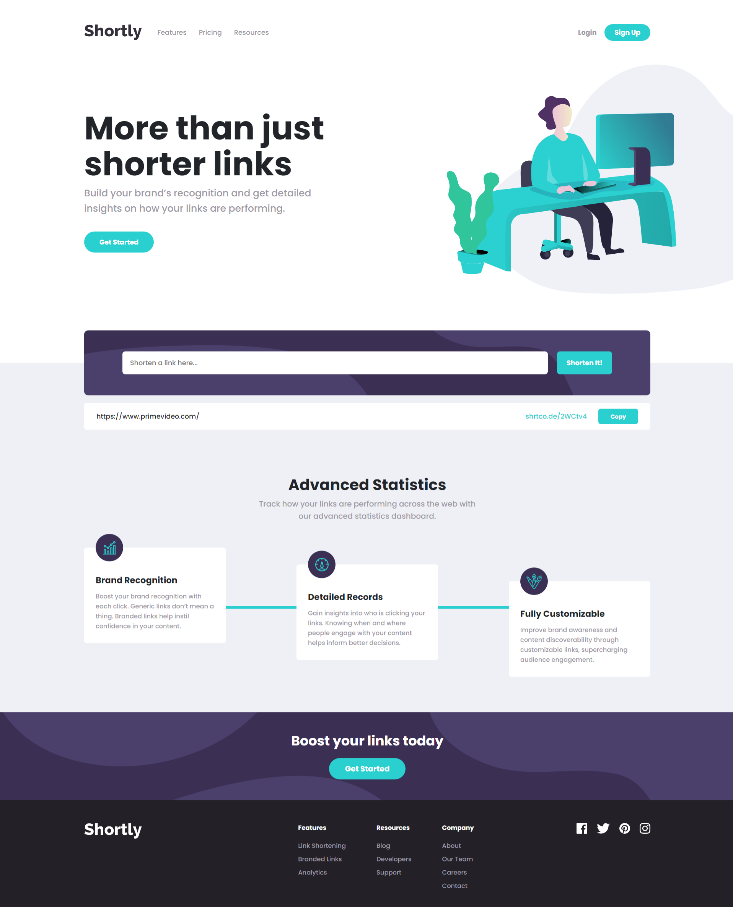

# Shortly URL shortening API build on React based on a Frontend Mentor Challenge

## The challenge

The challenge was to build out a landing page, integrate it with the [shrtcode API](https://app.shrtco.de/) and making the page responsive.

### Screenshot

### Links

- [Live Site URL](https://federico-baez.github.io/URL-Shortener-App-React/)

